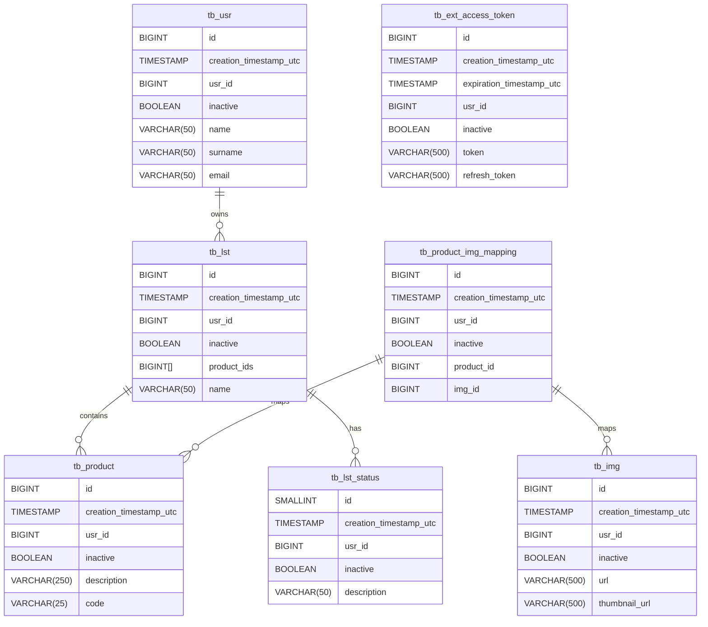
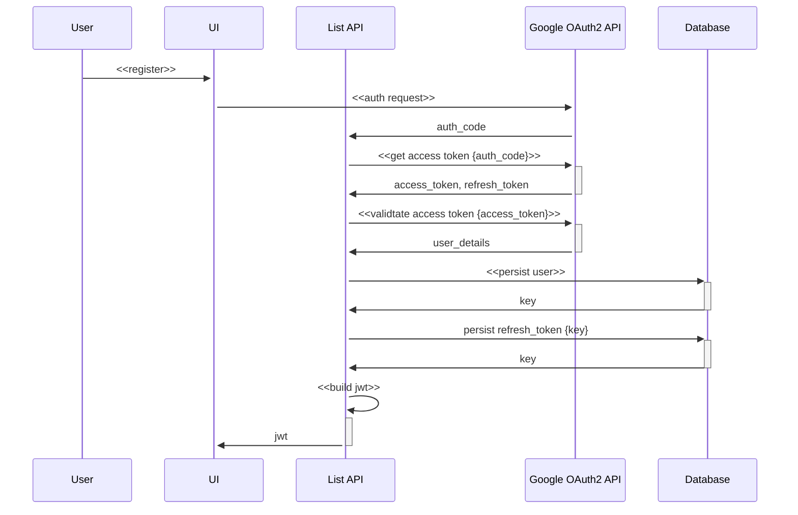

# slst (Shopping List)

## Table of Contents
- [Introduction](#introduction)
- [Components](#components)
  - [1. .NET 7 WebAPI](#1-net-7-webapi)
  - [2. Auth Module](#2-auth-module)
  - [3. Common Module](#3-common-module)
  - [4. Db Module](#4-db-module)
  - [5. FileStore Module](#5-filestore-module)
  - [6. Mapping Module](#6-mapping-module)
  - [7. PostgreQL DB](#7-postgresql-db)
  - [8. PM Collection](#8-pm-collection)
  - [9. Sample UI](#9-sample-ui)
- [Getting Started](#getting-started)
  - [Prerequisites](#prerequisites)
  - [Building and Running Containers](#building-and-running-containers)
- [Usage](#usage)
- [Configuration](#configuration)
- [Contributing](#contributing)
- [Testing](#testing)
- [License](#license)
- [Acknowledgments](#acknowledgments)

## Introduction

`slst` (Shopping List) is a software solution designed to manage shopping lists. It is composed various components to handle authentication, database operations, file storage operations, type mapping, and more.

## Components

### 1. .NET 7 WebAPI

[Ggl.Slst.Api](./src/apis/Ggl.Slst.Api)

The WebAPI serves as the orchestration layer for authentication workflows and shopping list (lst) management. It constructs users from payload data, validates user ID Tokens, and stores long-term refresh tokens for reuse. JWT is used for authentication.

For local development, a [build.docker.sh](./src/apis/build.docker.sh) script is included to build and run the API image.

```bash
./build.docker.sh 001
```

### 2. Auth Module

[Ggl.Slst.Auth](./src/apis/Ggl.Slst.Auth)

The Auth Module, implemented as a .NET 7 class library, supports OAuth2 authentication using Google as a third-party OAuth provider. To use this module, follow these steps to obtain an OAuth2 client-secret and client-key from the Google Developer Console.

### 3. Common Module

[Ggl.Slst.Common](./src/apis/Ggl.Slst.Common)

The Common Module, also a .NET 7 class library, contains essential Microsoft.Extensions modules used across all referencing modules. This includes modules for dependency injection, configuration, and options.

### 4. Db Module

[Ggl.Slst.Db](./src/apis/Ggl.Slst.Db)
[Ggl.Slst.Db.Integration.Tests](./src/apis/Ggl.Slst.Db.Integration.Tests)

The Db Module, implemented as a .NET 7 class library, provides utilities for accessing the database resources. It utilizes Dapper as an ORM and follows a CQRS-inspired design pattern, separating queries and commands. The module includes an integration test module (using Xunit) for CRUD operations against all database tables.

### 5. FileStore

[store](./src/store)

MinIO is used as the chosen file store provider. An [init.sh](./src/store/init.sh) script is included, and used by the Dockerfile to initialize the necessary buckets.

For local development, a [build.docker.sh](./src/store/build.docker.sh) script is included to build and run the MinIO image.

```bash
./build.docker.sh 001
```

[Ggl.Slst.FileStore](./src/apis/Ggl.Slst.FileStore)
[Ggl.Slst.FileStore.Integration.Tests](./src/apis/Ggl.Slst.FileStore.Integration.Tests)

The FileStore Module, another .NET 7 class library, contains abstractions for managing file storage. It integrates with Minio, and the module includes an integration test module (using Xunit) to test various file operations such as uploading, reading, downloading, and deleting test images.

### 6. Mapping Module

[Ggl.Slst.Mapping](./src/apis/Ggl.Slst.Mapping)

The Mapping Module, implemented as a .NET 7 class library, includes the AutoMapper package and helpful mapping configuration utilities.

### 7. PostgreQL DB

[db](./src/db)

A PostgreSQL database is utilized, and all initialization scripts (tables, functions, and seeding) are included. An [init.db.sh](./src/db/docker-entrypoint-initdb.d/init-db.sh) script is included, and used by the Dockerfile to initializes all dbos.

### 8. PM Collection

[tests](./src/tests)

A Postman collection is included containing some helpful requests for testing the interations with the Google OAuth endpoints, as well as token retrieval and shopping list (lst) management.

### 9. Sample UI

[slst-sample-ui](./src/ui/slst-sample-ui)

A sample user interface is provided, written in Vue.js and Quasar, for testing OAuth functionalities.

## Getting Started

### Prerequisites

List of prerequisites needed before users can start with your project.

### Building and Running Containers

A [docker-compose.yml](./docker-compose.yml) is included at the root level.
[NOTE: STILL A WORK IN PROGRESS]

# DESIGN

## ERD


## REGISTRATION FLOW (OAUTH2)

