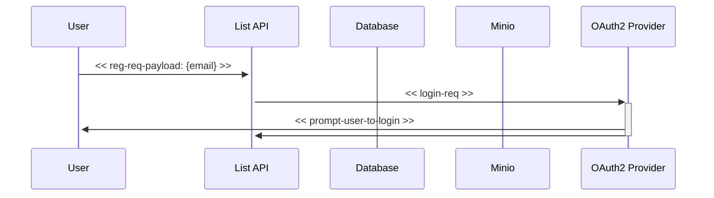

# ggl-assessment

GGL SSD assessment.

# CORE USE-CASES

- OAuth2 integration
- Manage (shopping list) state

# DESIGN

```mermaid
sequenceDiagram

  participant usr as User
  participant lstApi as List API
  participant db as Database
  participant files as Minio
  participant oauth2 as OAuth2 Provider

  usr ->>+ lstApi: << reg-req-payload: {email} >>
  lstApi ->>+ oauth2: << login-req >>
  oauth2 ->>+ usr: << prompt-user-to-login >>

  oauth2 ->>- lstApi:


```
